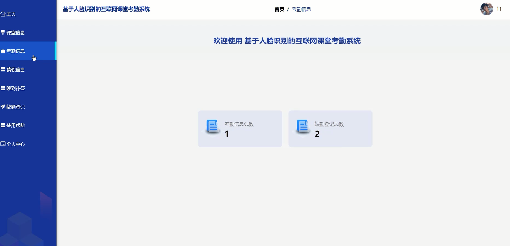
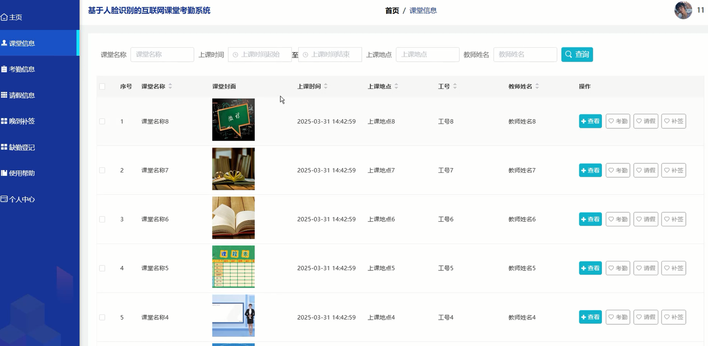
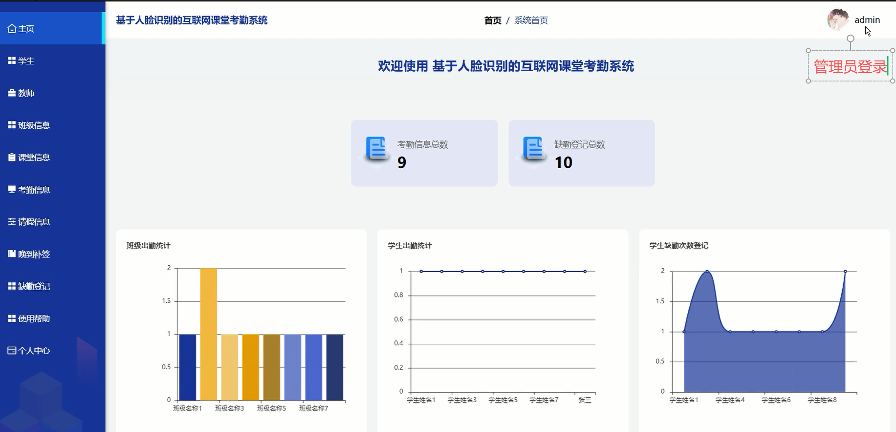
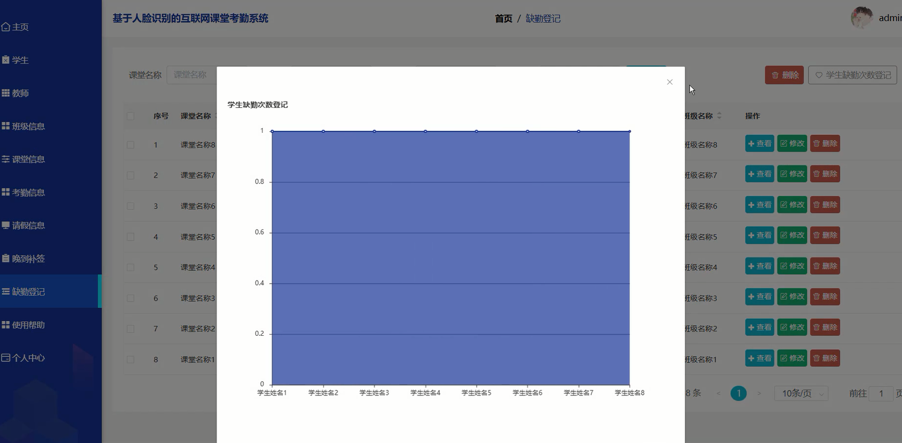

# 基于人脸识别互联网课堂考勤系统

## 介绍
基于人脸识别的互联网课堂考勤系统，采用Springboot-Vue-Mysql，B/S 结构，人脸识别算法，Echarts可视化等技术实现

## 前言介绍
1、如今，在科学技术飞速发展的情况下，信息化的时代也已因为计算机的出现而来临，信息化也已经影响到了社会上的各个方面。它可以为人们提供许多便利之处，可以大大提高人们的工作效率。随着计算机技术的发展的普及，各个领域也都体会到其强大的数据处理能力，这也成为各行各业不可或缺的工具。所以计算机技术被广泛应用于信息管理系统和数据处理等方面。通过它可以大大减少相关的工作处理步骤，也可以提高信息和数据的安全性。

2、本文对信息的问题进行了分析，发现目前线下管理和数据安全方面一些所存在的问题，所以决定通过计算机技术，使用MySQL和Springboot框架技术来实现基于人脸识别的互联网课堂考勤系统。学生和教师可以通过本系统进行查看相关信息。管理员也可以在本系统上进行一些信息管理，如课程管理、课程分类、学生人脸识别考勤、上课考勤、学生信息，教师信息等管理。从而是能够加快学校的发展，节省资源，为学校的可持续发展提供良好的基础。

3、基于人脸识别的互联网课堂考勤系统是一种网络化的管理软件，于是本系统提供了课程管理、课程分类、学生人脸识别考勤、上课考勤、学生信息，教师信息管理，学生教师注册登录退出等功能，为本行业节省了大量的时间和人力成本。同时，该系统还提供了灵活的权限管理和角色分配功能，以及良好的用户体验和可扩展性，可根据用户的具体需求进行二次开发和定制。

## 01开发环境
1.1 Java  技术

1.2 Spring Boot 框架

1.3 MySQL数据库

1.4 B/S 结构

1.5 Vue.js 技术

1.8 人脸识别算法

## 02系统功能模块
亮点（人脸识别、Echarts可视化，学生教师管理员多角色）

1、数据管理：爬虫信息列表展示。

2、数据存储：mysql数据库。

3、可视化：Echarts可视化展示

4、人脸识别

## 功能展示

